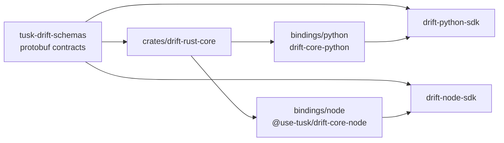
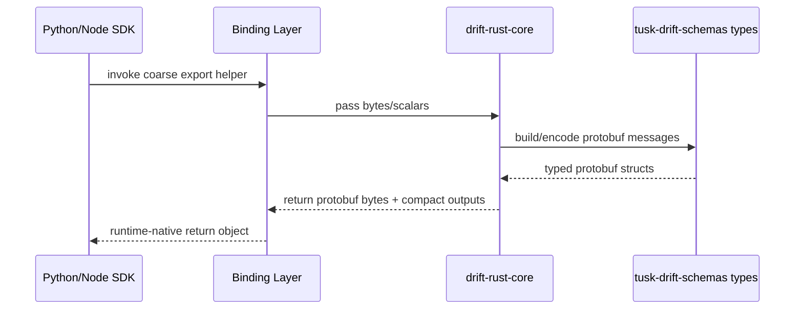

# Design

## Purpose

`drift-core` is the shared native core for Tusk Drift SDKs. It centralizes
deterministic, CPU-heavy logic in Rust and exposes it through language-specific
bindings for Python and Node.

This document describes the current architecture (as implemented), design
constraints, and the near-term evolution path.

## Goals

- Keep cross-SDK behavior consistent for core transformation logic.
- Reduce duplicated implementation across Python and Node SDKs.
- Improve hot-path CPU performance where FFI overhead can be amortized.
- Keep SDK instrumentation and framework hooks language-native.

Non-goals:

- Rewriting framework/runtime instrumentation in Rust.
- Owning protobuf schema definitions in this repository.
- Introducing user-facing SDK API breaks just to adopt Rust internals.

## Current state

Rust core public API currently exports:

- normalization and hashing (`normalize_json`, `deterministic_hash`, `normalize_and_hash`)
- protobuf `Struct` conversion helpers
- span protobuf byte construction (`build_span_proto_bytes`)
- export request protobuf byte construction (`build_export_spans_request_bytes`)
- coalesced export payload helpers (`process_export_payload`, `process_export_payload_value`)

## Architecture and ownership boundaries

Diagram notes:

- `tusk-drift-schemas` feeds both sides:
  - Rust core (via Rust crate types used for protobuf modeling/encoding).
  - SDKs directly (via language-native generated schema packages and types).
- `drift-core` bindings are an implementation dependency of SDKs, while schema
  packages remain a contract dependency.
- SDKs still own runtime instrumentation and lifecycle integration; the Rust
  path is focused on shared transformation/serialization internals.

### Source of truth for contracts

[`tusk-drift-schemas`](https://github.com/Use-Tusk/tusk-drift-schemas) owns protobuf contracts. `drift-rust-core` consumes Rust
types from the published `tusk-drift-schemas` crate and does not maintain a
separate proto source of truth.

### Rust core responsibilities

- Deterministic data transformations that must match across SDKs.
- Byte-oriented protobuf assembly helpers to reduce language runtime overhead.
- Error mapping primitives for binding wrappers.

### Binding responsibilities

- Thin API surface for each runtime (`pyo3`, `napi-rs`).
- Runtime-appropriate type conversion and error presentation.
- Packaging, publishing, and platform artifact strategy per ecosystem.

### SDK responsibilities (outside this repo)

- Instrumentation hooks and runtime integration behavior.
- Feature flags and fallback policy at SDK level.
- Request lifecycle behavior and framework-specific edge handling.

## Data boundary design

The primary boundary is bytes-first for protobuf-related operations.

Why:

- Avoid expensive cross-language object graph marshaling.
- Keep behavior tied to schema contracts rather than ad-hoc models.
- Enable coarse-grained calls that amortize FFI overhead.

The design principle is to prefer one coarse operation over many fine-grained FFI calls in hot paths.

## Correctness model

Correctness is enforced by multiple layers:

- schema compatibility guarantees from `tusk-drift-schemas`
- Rust unit/integration tests in `drift-rust-core`
- cross-language parity smoke tests in `tests/parity`
- SDK-side integration/e2e validation (outside this repo)

When protobuf encoding byte-for-byte determinism is not guaranteed, tests should
favor semantic decode-and-compare assertions.

## Performance model

Expected wins are strongest for:

- deterministic normalization/hashing in Python-heavy code paths
- protobuf construction/conversion workloads
- coalesced export helper paths that reduce Python/Node-side processing

Expected weaker or mixed wins:

- network-bound routes
- low-iteration benchmark lines with high variance
- very fine-grained FFI call patterns (especially on Node)

Design implication: optimize for coarse boundaries and end-to-end hot path
reduction, not isolated microbench speed alone.

## Packaging and compatibility

Published artifacts:

- Python: `drift-core-python` (PyPI), built with `abi3` (`abi3-py39`) for
  broad CPython 3.9+ compatibility on a given OS/arch.
- Node: `@use-tusk/drift-core-node` (npm), shipped as native addon artifacts.

Versioning:

- lockstep versioning across workspace `Cargo.toml`, Python `pyproject.toml`,
  and Node `package.json`.
- Rust binding crates in the workspace are internal (`publish = false`) and use
  `version.workspace = true`.

## Operational principles

- Keep language bindings thin; put shared behavior in Rust core.
- Preserve fail-open behavior at SDK layer where Rust bindings are optional.
- Favor backward-compatible wrapper evolution while SDK integration matures.
- Document supported target matrix and fallbacks clearly.

## Near-term roadmap

1. Expand parity coverage with more fixture diversity and property-like cases.
2. Continue reducing residual non-Rust work around SDK FFI boundaries.
3. Add richer semantic protobuf comparison utilities in parity tests.
4. Keep focusing on stack-level wins, not only isolated function benchmarks.

## Out of scope in this doc

Framework-specific SDK internals, benchmark reports, and rollout policy details
live in the SDK repositories ([`drift-python-sdk`](https://github.com/Use-Tusk/drift-python-sdk), [`drift-node-sdk`](https://github.com/Use-Tusk/drift-node-sdk)) where those runtime decisions are made.
